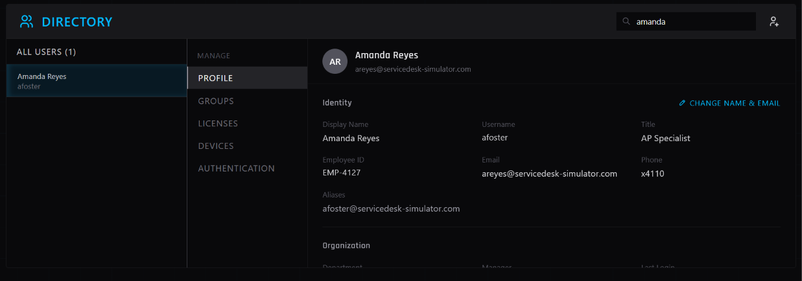

# IT Support Ticket: INC0012861

**Requester:** Amanda Foster (afoster@servicedesk-simulator.com)  
**Priority:** Low  
**Category:** Identity and Access Management (Account Update)  

## Issue
User requested a legal name change due to marriage. Required updating display name, setting a new primary email, and retaining the old email as an alias to ensure mail continuity. HR approval was confirmed in the request.

## Actions Taken
1. **Master Directory:** Located user account `afoster`.
2. **Account Update:** 
   - Updated Display Name to "Amanda Reyes".
   - Updated Primary Email to `areyes@servicedesk-simulator.com`.
   - Added `afoster@servicedesk-simulator.com` to the Email Aliases list.
   - Left the core Username (`afoster`) unchanged to preserve existing system permissions. *(See Figure 1)*.
4. **User Communication:** Replied to the user confirming the changes and advised her to log out and log back in to refresh her profile cache.

## Screenshots

**Figure 1: Updated User Profile in Master Directory**  

*Updated profile showing new display name, primary email, and legacy email configured as an alias.*

## Resolution
Account successfully updated with new legal name and primary email. Legacy email alias provisioned to prevent missed communications. Ticket closed.
