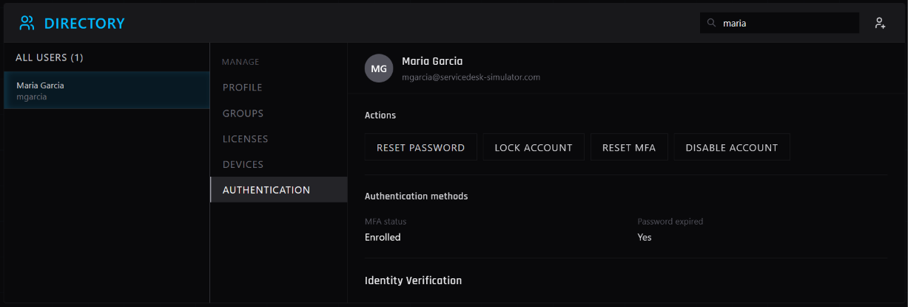
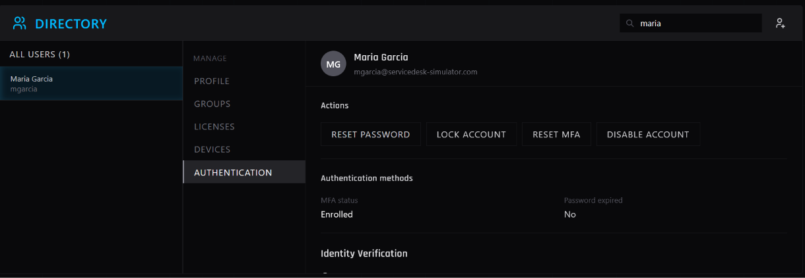
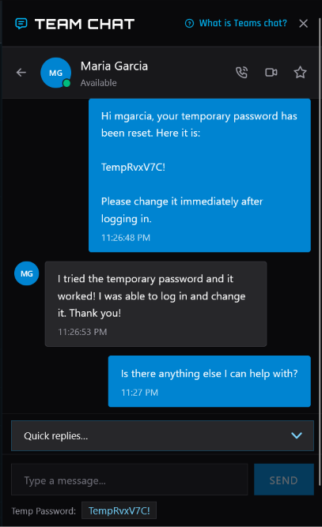

# IT Support Ticket: INC0012855

**Requester:** Maria Garcia (mgarcia@servicedesk-simulator.com)  
**Priority:** High  
**Category:** Identity & Access Management (Password Reset)  

## Issue
Lead Developer locked out of dev environment. Password expired after a 3-week vacation, and the self-service reset at the login screen was failing. Blocked on a Friday sprint deadline.

## Actions Taken
1. **Verified Identity:** Contacted user at x6102 to confirm identity before making changes.
2. **Master Directory:** Located user account `mgarcia`. 
3. **Executed Reset:** Used the directory's password reset function to generate a secure temporary password and saved the changes. *(See attached screenshots of reset confirmation)*.
4. **User Communication:** Provided the temporary password and instructed the user to create a new permanent password immediately upon first login.

## Screenshots

**Figure 1: User Account in Master Directory**  

*Located user account mgarcia

**Figure 2: Password Reset Confirmation**  

*Temporary password generated and account access restored.*

## Resolution
Account access restored. User successfully logged into the dev environment and confirmed she could resume work on the payment processing module. 
