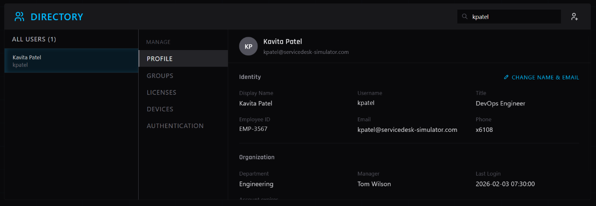
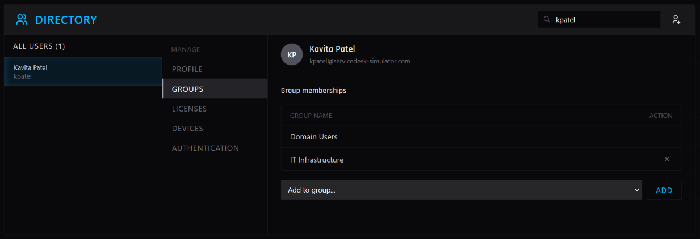

# IT Support Ticket: INC0012860

**Submitted By:** Tom Wilson (Manager)  
**Affected User:** Kavita Patel (kpatel@servicedesk-simulator.com)  
**Priority:** Medium  
**Category:** Identity & Access Management (Group Membership Change)  

## Issue
User transferring from Engineering to IT Infrastructure. Requires new infrastructure tool access and revocation of Engineering access per security policy. Access needed by Wednesday morning.

## Actions Taken
1. **Master Directory - Profile:** Located user account `kpatel` and verified current Engineering department assignment.
2. **Master Directory - Groups:** 
   - Removed user from Engineering security groups.
   - Added user to IT Infrastructure security groups.
3. **Verification:** Confirmed group membership changes saved successfully.
4. **User Communication:** Replied to manager (Tom Wilson) confirming access updated and ready for Wednesday morning start.
## Screenshots

**Figure 1: User Profile - Engineering Department**  

*Original profile showing Department: Engineering.*

**Figure 2: Group Membership - IT Infrastructure**  

*Updated group membership showing IT Infrastructure access, Engineering access removed.*
## Resolution
Group memberships updated successfully. Engineering access revoked, IT Infrastructure access provisioned. Ticket closed.
