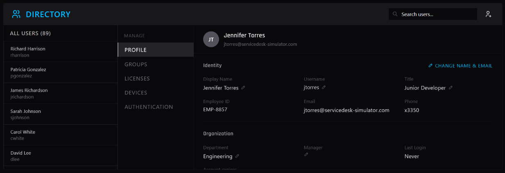
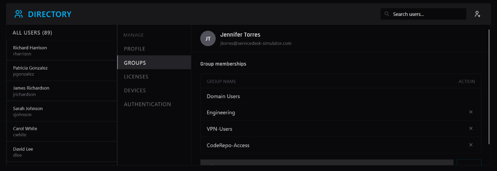

# IT Support Ticket: INC0012853

**Submitted By:** Robert Torres (Manager)  
**Affected User:** Jennifer Torres (jtorres@servicedesk-simulator.com)  
**Priority:** Medium  
**Category:** Identity & Access Management (New Hire Onboarding)  

## Issue
New Junior Developer starting Monday requires a new Directory account and specific group provisioning (Engineering, VPN-Users, CodeRepo-Access) for 9 AM orientation.

## Actions Taken
1. **Master Directory - Search:** Verified user `jtorres` did not yet exist in the system.
2. **Master Directory - Create User:** Generated new account with provided details:
   - Name: Jennifer Torres
   - Username: jtorres
   - Email: jtorres@servicedesk-simulator.com
   - Department: Engineering
   - Job Title: Junior Developer
   *(See Figure 1)*.
3. **Master Directory - Groups:** Navigated to Groups section and provisioned the three requested security groups: Engineering, VPN-Users, and CodeRepo-Access. *(See Figure 2)*.
4. **User Communication:** Replied to submitting manager (Robert Torres) confirming account creation and access provisioning is complete and ready for Monday 9 AM orientation.

## Screenshots

**Figure 1: New User Profile Creation**

*Newly created account showing name, username, email, department, and job title (Junior Developer).*

**Figure 2: Group Provisioning**

*Security groups successfully added: Engineering, VPN-Users, and CodeRepo-Access.*

## Resolution
New hire account created and RBAC group memberships provisioned exactly as requested. Account ready for Monday 9 AM orientation. Ticket closed.
